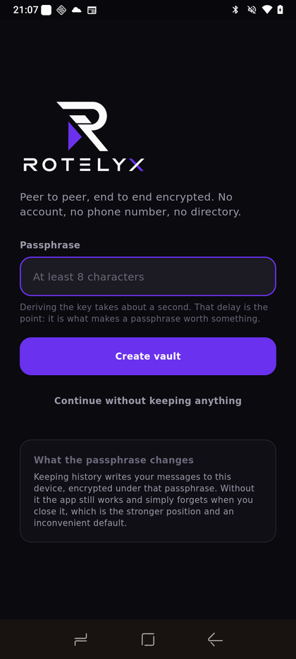
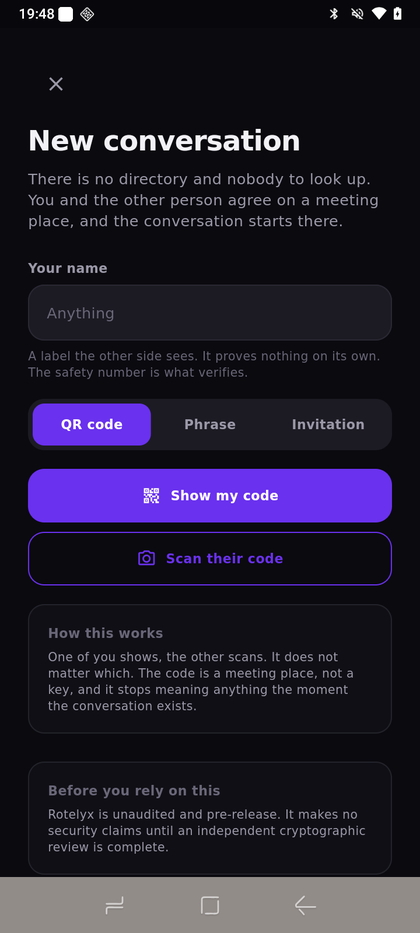
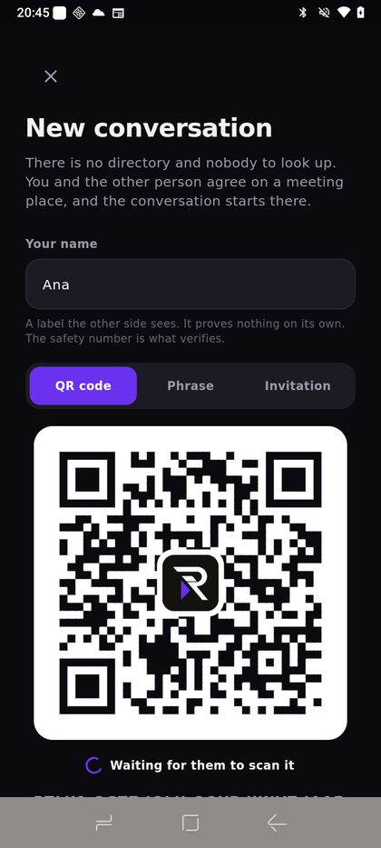
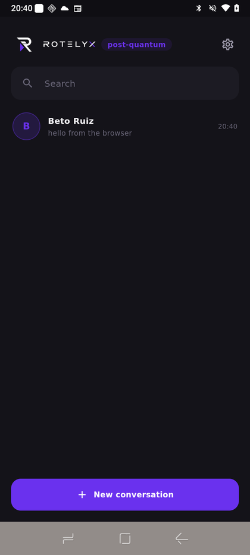
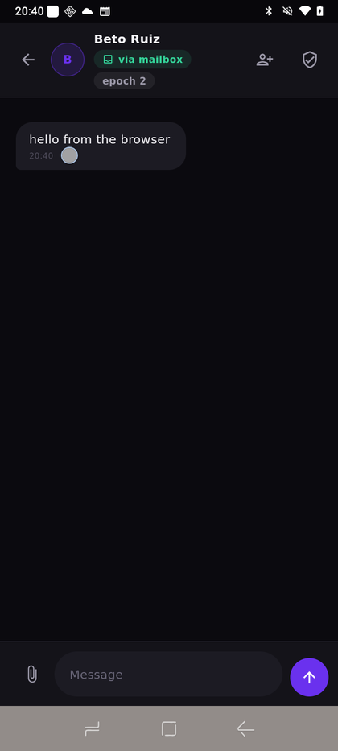
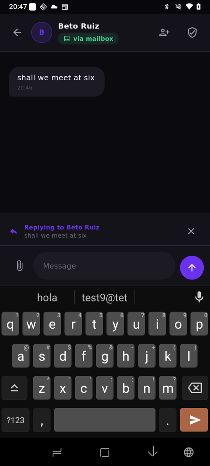
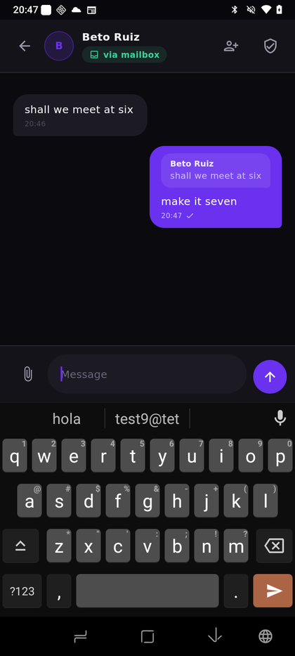
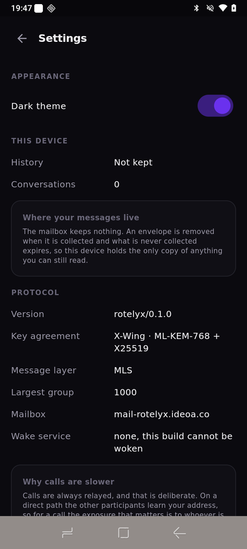

# The application, screen by screen

Every picture here is a screenshot of a release build running on a phone: a
Note 58 on Android 16, paired with a browser over the production mailbox. None
of them is a mockup and none was taken in a simulator.

Regenerate them with `tool/e2e/shots.py` for the web surfaces, or with
`adb exec-out screencap -p` while driving the device.

---

## Opening it

The first decision, and the only one the application insists on: does this
device keep anything.

A passphrase derives the key that seals what gets written down, with Argon2id at
64 MiB, which is why it takes about a second. Without one the application works
exactly the same and forgets when it closes, which is the stronger position and
an inconvenient default.

There is no account here. Nothing is being signed in to.

---

## Starting a conversation

There is no directory, so there is nobody to look up. Two people arrive at the
same meeting place instead, and there are three ways to agree where that is: a
QR code, a phrase you both type, or a long invitation you send through something
else.

The code is 29 characters, 120 random bits. It is an address at the mailbox, not
a key: it stops meaning anything the moment the conversation exists.

The mark in the middle is paid for out of the error-correction budget. The
symbol is drawn at the highest of the four correction levels, which can lose
thirty percent of itself and still read.

**This screenshot is also a test.** `test/rendered_qr_test.dart` runs one of
these through the application's own decoder, so a change that makes the code
prettier and unscannable fails the build rather than shipping.

---

## The conversation list

Named after the person, not after the meeting phrase. The name travelled in the
handshake and is a claim rather than an identity, which is what the safety
number in each conversation is for.

Unread conversations carry a count, pinned ones sort above the rest, and muted
ones say so.

---

## A conversation

`via mailbox` is the route, and it is shown because it changes with
circumstance. The shield opens the safety number.

The tick means the mailbox accepted the envelope, which is the only delivery
fact that exists here. Not delivered, not read, unless the other person has
turned receipts on for this conversation and therefore chosen to send one.

---

## Replying

 

Swipe a message to answer it.

The quote travels inside the reply rather than pointing at the original,
because there is no message id on the wire. An id would be a handle the mailbox
could use to correlate one envelope with another, and the addressing here exists
to prevent exactly that. The cost is a few dozen bytes in an envelope that was
going to be padded to a fixed size anyway.

The quote is drawn as a smaller bubble in the same shape language, tinted rather
than outlined. No rule down the left edge: that is the default every framework
reaches for, and the direction the field has moved is the opposite one.

---

## Settings

The protocol is stated rather than hidden. Version, key agreement, message
layer, the largest group the engine will build, which mailbox is in use, and
which service can wake the device.

**That version string is proof of something.** `rotelyx/0.1.0` can only come
from a call into `librotelyx_mobile.so`, so seeing it on a phone means the
native engine loaded and answered. It is the same crate the browser runs as
WebAssembly.

Calls are always relayed, and there is no switch. On a direct path the other
participants learn your address, so for a call the exposure that matters is to
whoever is on it rather than to a server.
